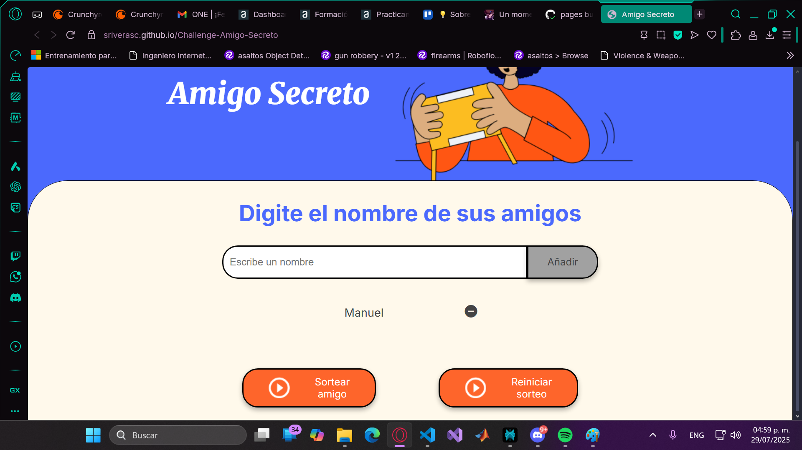

# Challenge amigo secreto
Este proyecto es el primer challenge del curso de lógica de la programación; en el cual se introducirán una lista de nombres y se seleccionará uno de forma pseudoaleatoria.

## Tabla de Contenidos
- [Instalación](#instalación)
- [Uso](#uso)
- [Características](#características)
- [Tecnologías utilizadas](#tecnologías-utilizadas)
- [Estructura del proyecto](#estructura-del-proyecto)

## Instalación
Este proyecto no requiere de alguna dependencia externa, ya que en el proyecto solo se usa puro JS vanilla. Sin embargo es recomendable ejecutar el proyecto usando la extensión de VS Code: Live Server.

## Uso
En esta sección, se describen algunos casos de uso de la aplicación:

- Agregar un nombre:
    1. Introducir nombre en el campo de: "Escribe un nombre".
    
    2. Dar clic en el botón de añadir.
    
    3. Errores: En caso de que no se llene el campo, se ponga un espacio en blanco, se incluyan algunos caractéres especiales (como el @) en el nombre o se quiera introducir un nombre repetido, aparecerán las siguientes alertas:
    
    
    
    Si se desea poner 2 o más nombres repetidos, se deberán incluir los demás nombres usando variantes del nombre o agregando letras al final del nombre como: Sebastian A, Sebastian B, ..., Sebastian Z
- Sortear los nombres:
    1. Para sortear los nombres debe darse clic en el boton de: "Sortear amigo"
    
    2. Errores: Se deben poner 2 o más nombres.
    
- Casos adicionales:
    1. Se puede eliminar un nombre en específico de la lista haciendo clic en el botón de remover.
    
    2. Se puede reiniciar el sorteo dando clic en el boton: "Reiniciar sorteo".
    

## Características
- Ingresar nombres.
- Validar datos de entrada.
- Validar longitud de la lista.
- Visualizar contenido de la lista.
- Sorteo aleatorio de los nombres.
- Eliminar nombre de la lista.
- Limpiar lista de nombres.
- Iniciar un nuevo sorteo de nombres.

## Tecnologías utilizadas
- HTML
- CSS
- JavaScript

## Estructura del proyecto

```
challenge-amigo-secreto/
│
├── index.html              # Archivo principal HTML
├── style.css               # Estilos CSS
├── script.js               # Lógica principal en JavaScript
├── readme.md               # Documentación del proyecto
└── assets/                 # Carpeta para imágenes u otros recursos
    └── amigo-secreto.png            # (Ejemplo) Logo o imágenes usadas en la app
    └── play_circle_outline.png
```